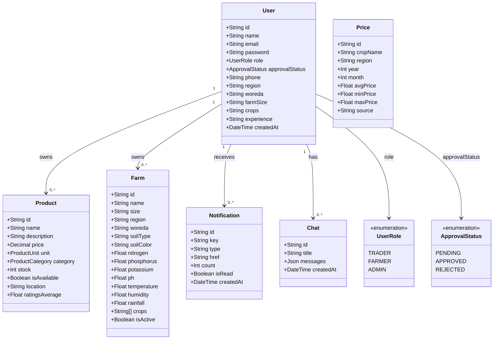
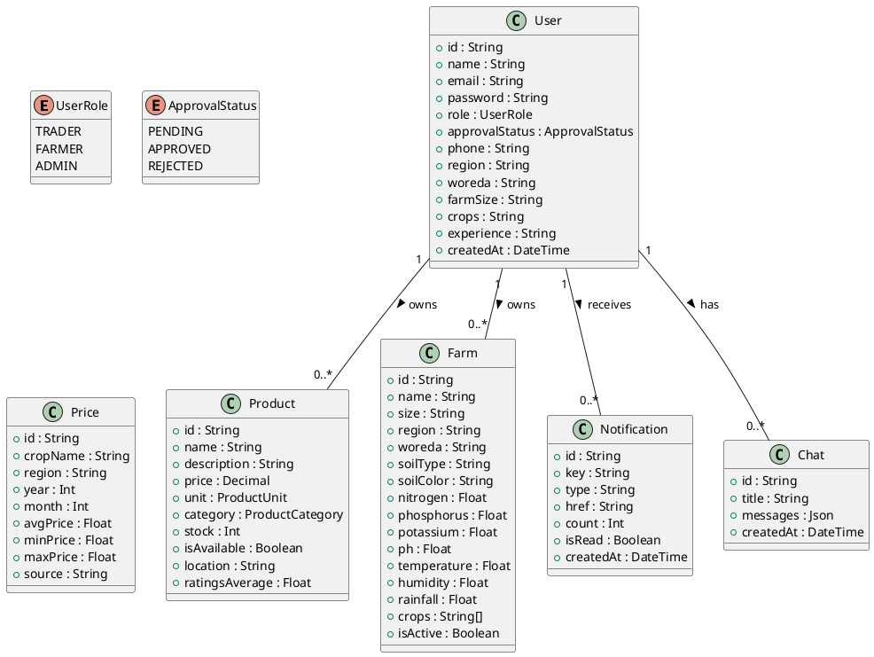
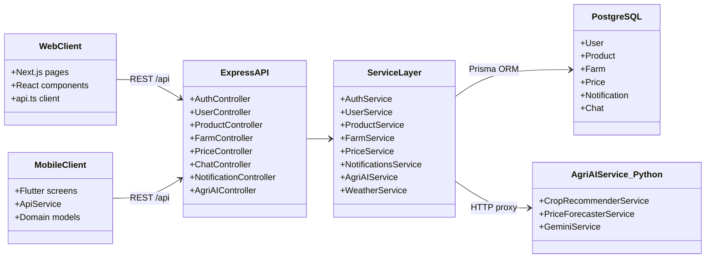
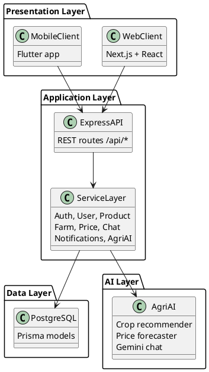

# AgriMarket Simple Class Diagram

Use either **Mermaid** (works in Google Docs add-ons, Notion, GitHub, many thesis templates) or **PlantUML** (works in draw.io, Lucidchart, Word with PlantUML plugin).

---

## Diagram 1 — Domain Model (recommended for your docs)

This reflects the main entities in [`server/prisma/schema.prisma`](server/prisma/schema.prisma).

### Copy-paste: Mermaid



### Copy-paste: PlantUML



---

## Diagram 2 — System Architecture (optional, simpler overview)

Shows how the three tiers connect. Based on [`server/src/index.js`](server/src/index.js) routes and [`agriAI/api/main.py`](agriAI/api/main.py).

### Copy-paste: Mermaid



### Copy-paste: PlantUML



---

## Entity relationship summary (for caption text in your doc)

| Entity | Description | Key relationships |
|--------|-------------|-------------------|
| **User** | Farmer, Trader, or Admin account | Owns Products and Farms; has Chats and Notifications |
| **Product** | Crop listing posted by a farmer | Belongs to one User (farmer) |
| **Farm** | Farmer land plot with soil/climate data | Belongs to one User (farmer); used for AI recommendations |
| **Price** | Historical market price record | Standalone reference data (crop + region + month) |
| **Notification** | In-app alert | Belongs to one User |
| **Chat** | AI assistant conversation history | Belongs to one User |

---

## Which format to use in your doc

- **Google Docs / Word**: Paste **PlantUML** into [plantuml.com/plantuml](https://www.plantuml.com/plantuml/uml/) → export PNG/SVG → insert image. Or use a Mermaid add-on if installed.
- **Notion / GitHub / Markdown thesis**: Paste **Mermaid** directly inside a ` ```mermaid ` code block.
- **draw.io**: Import PlantUML or recreate from Diagram 1 manually.

No code changes are required — this is documentation-only output ready to copy.
